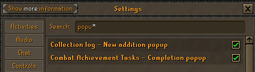
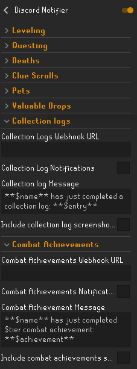

# Discord Notifier

This RuneLite plugin enhances your daily grinds by sending real-time updates to your Discord channel. You can get
notified
instantly when you:

- Level up a skill
- Complete a quest or clue
- Receive a pet or a valuable drop
- Complete a collection log or combat achievement
- Or unfortunately meet your character's demise.
  For added proof and bragging rights, the plugin can optionally include a screenshot with each notification.

## Webhook Setup

In order to use this plugin you will need to create a webhook on your discord server. Below are instructions for how to
do so:

1. Open your Server Settings and head into the Integrations tab
2. Click the "Create Webhook" button to create a new webhook
3. Once created, copy the webhook URL and insert into the "Webhook URL" box in the plugin's configuration in RuneLite.

## RuneScape Settings Setup

In order for the collection log or combat achievement to be sent to your Discord webhook, you need to make sure the
following are enabled in your RuneScape settings:

## Plugin Preview

## Useful Variables for Notification Messages

**COMMON**

$name - Your OSRS name

**LEVELING**

$skill - Name of skill that you leveled up

$level - The new level you just received

$total - Your new total level

**QUESTING**

$quest - The name of the quest you have just completed

**CLUE SCROLLS**

$tier - The tier of the clue scroll you just completed (beginner, easy, medium, etc.)

$value - The value of the reward you just received

**VALUABLE DROPS**

$itemName - Name of the item that you just received

$itemValue - The value of the item that you just received

**COLLECTION LOGS**

$entry - The name of the item that you just added to your collection log

**COMBAT ACHIEVEMENTS**

$tier - The tier of the combat achievement that you just completed

$achievement - The name of the achievement that you just completed

## Plugin Support

Discord: peepomase

OSRS IGN (my private chat is open): MaseOSRS

GitHub Issue: https://github.com/MasonGarrett/RuneLite-Discord-Notifier/issues

## Contribution

Initially forked from: https://github.com/cepawiel/RuneLite-Discord-Notifications